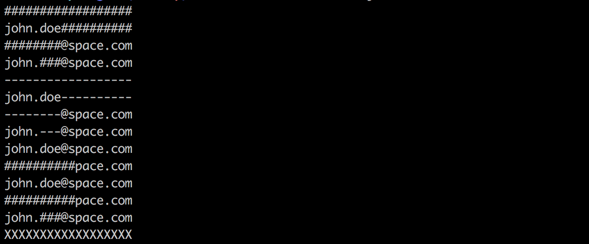

# maskinput [](https://badge.fury.io/js/maskinput)[](https://travis-ci.org/shariati/maskinput)[](https://coveralls.io/github/shariati/maskinput?branch=master)[](https://snyk.io/test/github/shariati/maskinput)
Masks the input strings




## Install

```
$ npm install --save maskinput
```


## Usage

```js
const maskinput = require('maskinput');

console.log(maskinput('john.doe@space.com'));

/*

    ##################

 */
```


## CLI

```
$ npm install --global maskinput
```

```
$ maskinput --help

  Usage
    maskinput <string>
    maskinput <string> --totalUnmaskedTrailingCharacters 10
    maskinput <string> --totalUnmaskedLeadingCharacters 5 --totalUnmaskedTrailingCharacters 10
    maskinput <string> --maskedCharacter X
    echo <string> | maskinput

  Example
    maskinput 'john.doe@space.com'
    ##################

    maskinput 'john.doe@space.com' --maskedCharacter X
    XXXXXXXXXXXXXXXXXX

    maskinput 'john.doe@space.com' --totalUnmaskedLeadingCharacters 5 --totalUnmaskedTrailingCharacters 10
    john.###@space.com

